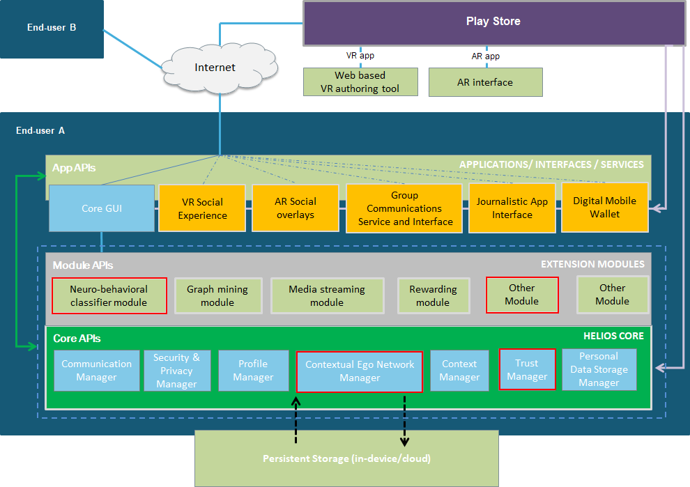

<h1>Trust Manager module</h1>

The Trust Manager is a multithreaded module that periodically computes a new trust value for each node in each active context, and then updates the Contextual Ego Network with the newly computed trust value by storing it onto the corresponding edge.

 Each running thread of the Trust Manager corresponds to an active context; whenever a context becomes inactive, the respective thread is put to a wait state through a condition variable. 

Other HELIOS modules can then utilize the calculated trust value directly from the CEN and based on the user’s policy make decisions, e.g., what part of the profile can be shared, how urgent the message from an alter is to the ego, and so on.

<h2>About the module</h2>

The Trust Manager depends on the following HELIOS modules:
<ul>
	<li>Neuro-Behavioural Classifier module</li>
	<li>Contextual Ego Network Manager</li>
	<li>Proximity module</li>
	<li>Context Aware Profiling module</li>
</ul>

This module provides APIs to get trust scores related to the relationship between the ego and each alter in the Contextual Ego Network, differentiating them based on the context of reference. For each new alter, the module computes an initial trust value that only takes into consideration the information that is available at that stage; each trust value is then updated every set interval of time by also taking into account the information that can be derived from a sentimental analysis of the interactions, performed by the Neurobehavioural module.

<h2>How to use the module</h2>
To start the Trust Manager, it is necessary to instantiate the object, by calling the constructor method, and then call the startModule method. The manager will automatically instantiate all the threads related to the active contexts.

The following methods are invoked by the Trust Manager whenever precise events take place in the Contextual Ego Network. Such methods are invoked automatically by some callbacks that are registered on the Contextual Ego Network.

<ul>
	<li> Whenever a new context is added to the Contextual Ego Network, the <i>newContext</i> method is triggered: the Trust Manager instantiates a new thread for the new context, and from that moment on (up until such context is deactivated) trust values for the nodes in it are computed every deltaT seconds. </li>
	<li>Whenever a new alter is added to a context in the Contextual Ego Network, the <i>addAlterToContext</i> method is triggered: the thread related to that context is notified and gives an initial trust score to the new alter. From that moment on, up until such context is deactivated, trust values for the new alter in that specific context are computed every deltaT seconds.</li>
	<li>Whenever a context’s status is switched to active, the <i>activateContext</i> method is triggered: the Trust Manager notifies the thread related to that context, that from that moment on (up until such context is deactivated again) starts computing trust values for all the nodes in it every deltaT seconds.</li>
	<li>Whenever a context’s status is switched to inactive, the <i>deactivateContext</i> method is triggered: the Trust Manager notifies the thread related to that context, that computes a last set of trust scores for all the nodes in it and is then put on hold on a condition variable (up until such context is activated again).</li>
</ul>

<h2>Project Structure</h2>
This project is structured as follows:
<ul>
	<li>The <b>src</b> directory contains the source code files.</li>
	<li>The <b>docs</b> directory contains the documentation for the source code.</li>
</ul>
